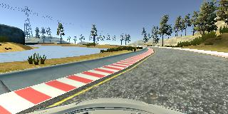
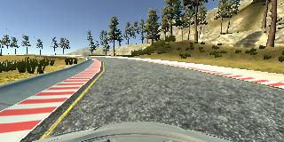

# Behavioral Cloning Project

The goals / steps of this project are the following:  
* Use the simulator to collect data of good driving behavior  
* Build, a convolution neural network in Keras that predicts steering angles from images   
* Train and validate the model with a training and validation set  
* Test that the model successfully drives around track one without leaving the road  
* Summarize the results with a written report  


## Rubric Points  
###Here I will consider the [rubric points](https://review.udacity.com/#!/rubrics/432/view) individually and describe how I addressed each point in my implementation.    

---
###Files Submitted & Code Quality  

####1. Submission includes all required files and can be used to run the simulator in autonomous mode

My project includes the following files:  
* model.ipynb containing the script to create and train the model  
* drive.py containing a script for driving car   
* model.h5 containing a trained convolution neural network   
* writeup_report.md summarizing the results  
* run1.mp4 contains video of autonomous mode  

####2. Submission includes functional code
Using the Udacity provided simulator and my drive.py file, the car can be driven autonomously around the track by executing 
```sh
python drive.py model.h5
```

####3. Submission code is usable and readable

The model.ipynb file contains the code for training and saving the convolution neural network. The file shows the pipeline I used for training and validating the model, and it contains comments to explain how the code works.

###Model Architecture and Training Strategy

####1. An appropriate model architecture has been employed

The data is normalized in the model using a Keras lambda layer.  

My model consists of a:  
    - Convolution neural network with 3x3 filter sizes and depth 8   
    - RELU layers to introduce nonlinearity    
    - Maxpooling 2x2  
    - Dropout   
    - Fully connected layer  

####2. Attempts to reduce overfitting in the model

The model contains dropout layers in order to reduce overfitting.  

Training Data was shuffled and devided to training data sets and test data sets.  
The model was trained and validated under cross-validation, and evaluated with test data sets.  

The model was tested by running it through the simulator and ensuring that the vehicle could stay on the track.  

####3. Model parameter tuning  

The model used an adam optimizer, so the learning rate was not tuned manually.

####4. Appropriate training data

Training data was chosen to keep the vehicle driving on the road.  
I used a combination of center lane driving, jig-zag emergency recovering.  
And also, horizontal flip data were augmented.  

For details about how I created the training data, see the next section.  

###Model Architecture and Training Strategy  

####1. Solution Design Approach  

The overall strategy for deriving a model architecture was to keep simple as much as possible.

My first step was to use a convolution neural network model similar to the CIFAR10 model (deeper layers and deeper kernels in conv layer).  
I thought this model might be appropriate because of its good feature on detecting colored objects.

In order to gauge how well the model was working, I checked loss of training and validation set with 11,500 samples. 
I found that my first model had a low mean squared error on the training set but a high mean squared error on the validation set.  This implied that the model was overfitting. 

To combat the overfitting, I increased size of training data, and then augmented them by flipping, and I checked loss of training and validation set with 40,000 (training) + 4,000 (validation) samples. 

The final step was to run the simulator to see how well the car was driving around track one.   At the end of the process, the vehicle is able to drive autonomously around the track without leaving the road.

####2. Final Model Architecture

The final model architecture consisted of a convolution neural network with the following layers and layer sizes.  


| Layer         		|     Description	        				| 
|:---------------------:|:---------------------------------------------:| 
| Input         		| 160x320x3 RGB image (cropping)                           | 
| Convolution 3x3     	| 1x1 stride, same padding, outputs 160x320x8 	|
| RELU			|					                        |
| Max pooling	      	| 2x2 stride,  outputs 80x160x8 			|
| Convolution 3x3	| 1x1 stride, valid padding, outputs 80x160x8	|
| RELU					|				 |
| Max pooling	      	| 2x2 stride,  outputs 40x80x8 			    |
| Dropout				| 0.25					|
| Fully connected		| 25600 x 256  						|
| RELU					|					|
| Dropout				| 0.5					|
| Fully connected		| 256 x 1   						|
|						|				|
|						|			|
 

####3. Creation of the Training Set & Training Process

To capture good driving behavior, I first recorded one lap on track one using center lane driving.

  

There were a few spots where the vehicle fell off the track:  
    - close to right lane with parallel   
    - left turn road with steep curve     
    to improve the driving behavior in those cases, I increase normal driving images and jigzag driving left lane to right lane and also around lane small range jigzag, especially steep handle angle with slow speed at off points.

I then recorded the vehicle recovering from the left side and right sides of the road back to center so that the vehicle would learn recovering. These images show what a recovery:

   
   


To augment the data set, I also flipped images.  

I finally randomly shuffled the data set and put 10% of the data into a test set, and then put 10% of the training data into a validation set. 

The validation and test set helped determine if the model was over or under fitting. The ideal number of epochs was 5 as evidenced by trying over 10 epochs with several network models.  
